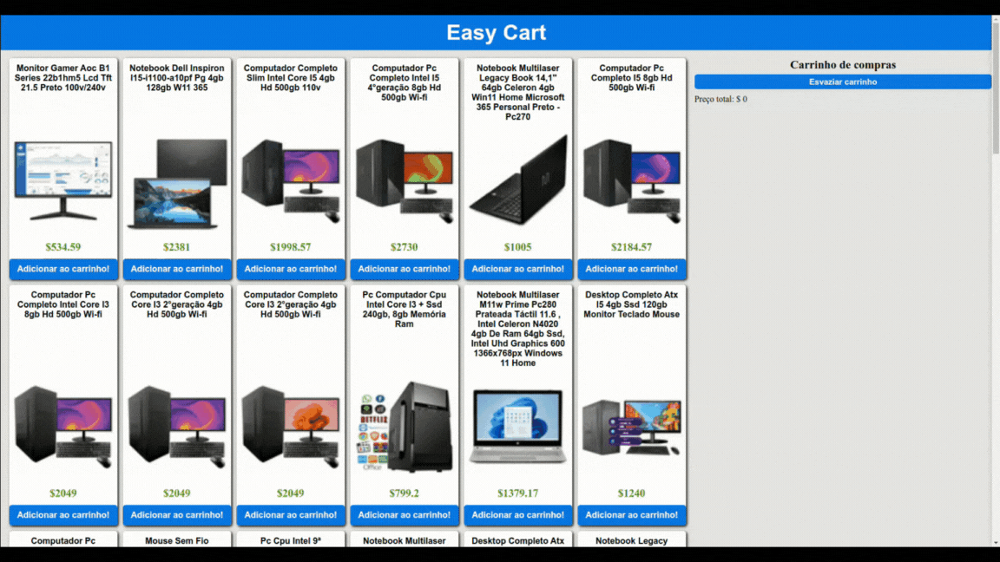

<div>
  <a href="README.md">🇺🇸 English</a> |
  <a href="README.pt.md">🇧🇷 Portuguese</a>
</div>

<h1 align="center">
  <br/>
    Easy Cart
</h1>

<p align="center">
  
</p>

<h2 align="center">
  <a href="#funcionalidades">Funcionalidades</a> •
  <a href="#como-usar">Como Usar</a> •
  <a href="#contribuindo">Contribuindo</a> •
  <a href="#licença">Licença</a>
</h2>

---

## Visão Geral Básica

Este projeto é um aplicativo de carrinho de compras simples desenvolvido usando HTML5, CSS3 e JavaScript. Ele permite que os usuários naveguem por uma lista de itens, os adicionem ao carrinho e vejam o preço total dos itens no carrinho. O projeto é projetado para simular a funcionalidade de um carrinho de compras real e pode ser usado como ponto de partida para construir aplicativos de comércio eletrônico mais complexos.



O projeto está hospedado no GitHub Pages e pode ser acessado através do seguinte link: https://cleytonoliveira.github.io/easy-cart/

## Funcionalidades

O projeto inclui as seguintes funcionalidades:

- Exibição de uma lista de itens disponíveis para compra.
- Adição de itens ao carrinho.
- Remoção de itens do carrinho.
- Atualização do preço total do carrinho.

## Como Usar

1. Clone este repositório em sua máquina local:

```bash
git clone git@github.com:cleytonoliveira/easy-cart.git
```

2. Navegue até o diretório do projeto:

```bash
cd easy-cart
```

3. Abra o arquivo `index.html` em seu navegador da web.

4. Agora você deverá ver o aplicativo Easy Cart sendo executado em seu navegador.

## Contribuindo

Obrigado por considerar contribuir para este projeto! Para contribuir, siga estas etapas:

1. Faça um fork do repositório do projeto.
2. Crie um novo branch para a sua contribuição.
3. Faça as alterações ou adições necessárias.
4. Teste suas alterações minuciosamente.
5. Faça commit das suas alterações com mensagens de commit descritivas.
6. Envie as suas alterações para o seu repositório forked.
7. Envie uma solicitação pull para o repositório principal.

Por favor, certifique-se de que o seu código siga os padrões de codificação do projeto e siga as diretrizes estabelecidas.

## Licença

Este projeto está licenciado sob a [Licença MIT](LICENSE).
